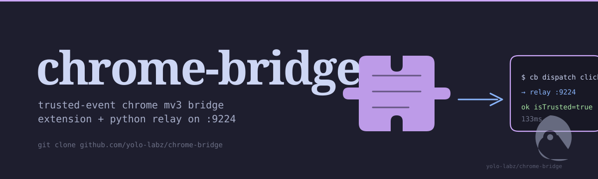
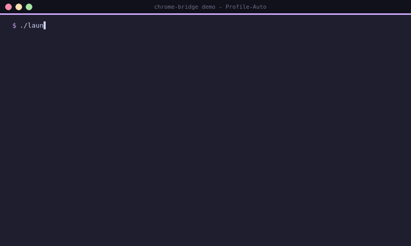

<picture>
  <source media="(prefers-color-scheme: dark)" srcset="docs/assets/hero-dark.svg">
  <source media="(prefers-color-scheme: light)" srcset="docs/assets/hero-light.svg">
  
</picture>

# chrome-bridge

> Trusted-event Chrome automation bridge for the yolo-labz fleet — MV3 first-party extension loaded into a dedicated **Profile-Auto** Chrome instance, paired with a localhost relay daemon (`cb` CLI) that any sibling plugin (`claude-mac-chrome`, `lcc`, `wa`) can shell out to.

Solves the `isTrusted=true` event-trust gate on Vue/React SPAs and the JA4+ TLS fingerprinting gate on regulated sites — without exposing Pedro's daily Chrome to CDP attach (catastrophic blast radius), without sending his cookies to a third-party SaaS like Browserbase (principle IX violation), and without the Patchright bundled-Chromium signature that LinkedIn Q1 2026 BrowserGate scanner now flags.

## Capability

**Pattern.** Trusted-event Chrome MV3 automation bridge — an unpacked MV3 extension is loaded into a dedicated **Profile-Auto** Chromium instance; its service worker long-polls a Python stdlib relay daemon on `127.0.0.1:9224`, dispatches jobs to `chrome.cookies` / `chrome.scripting` / `chrome.debugger.Input`, and returns results as JSON.

**Trade-off.** Requires an unbranded Chromium binary (Chrome 137+ `DisableLoadExtensionCommandLineSwitch` policy is now compiled in, so Google-branded Chrome silently drops `--load-extension`) and a one-time extension install — in exchange for `isTrusted=true` events that CDP-driven Playwright/Puppeteer cannot synthesize, and a relay surface that works on Linux where AppleScript is unavailable.

**Use when.** A Claude Code plugin or shell pipeline needs to inject trusted DOM events into a Vue/React SPA from a Linux or macOS workstation, with the daily Chrome profile untouched and stealth domains (LinkedIn, banking) hard-blocked in the extension source.

```bash
git clone https://github.com/yolo-labz/chrome-bridge
./launch/profile-auto.sh
./cli/cb dispatch <command>
```

## Demo

A 16-second screen-record of the bridge on a fresh stealth profile — `./launch/profile-auto.sh --bg` brand-guards the Chromium candidate, spawns Profile-Auto with the unpacked MV3 extension loaded, registers the relay on `127.0.0.1:9224`, and round-trips three `cb` verbs (`ping`, `tabs`, `debug-click`) including a trusted-event click returning `isTrusted: true`:



The capture runs against a fresh `--user-data-dir` with no real cookies, no real authentication, and no real PII; every value (`PID 184932`, the user-agent string, the timestamp) is a literal token rendered into the demo, not a leaked artifact from Pedro's daily session.

## How `chrome-bridge` compares

Closest peers in the Chrome automation ecosystem, scored against the use case (cross-platform trusted-event injection from a Python CLI):

| Capability | `chrome-bridge` | [`playwright`](https://playwright.dev) | [`puppeteer`](https://pptr.dev) | [`selenium`](https://www.selenium.dev) | [`claude-mac-chrome`](https://github.com/yolo-labz/claude-mac-chrome) |
|---|:---:|:---:|:---:|:---:|:---:|
| First-party trusted-event injection (`isTrusted=true`) | yes (MV3 + relay) | no (CDP — synthetic events) | no (CDP — synthetic events) | no (WebDriver — synthetic events) | no (AppleScript — OS-level) |
| Cross-platform (Linux + macOS) | yes | yes | yes | yes | macOS only |
| Pure stdlib Python CLI | yes | no (npm) | no (npm) | no (java/python+selenium) | n/a (Bash) |
| SLSA L2 + dual SBOM (CycloneDX + SPDX) + cosign | yes | depends on consumer | depends on consumer | depends on consumer | SLSA L3 |
| MV3 extension (vanilla JS, no React/build step) | yes | n/a | n/a | n/a | n/a |
| Chrome 137+ `DisableLoadExtensionCommandLineSwitch` handling | documented (brand-guard launcher) | not handled | not handled | not handled | n/a |
| Daily Chrome untouched (isolated `--user-data-dir`) | yes (Profile-Auto) | depends on caller | depends on caller | depends on caller | depends on profile |
| STEALTH_DOMAINS hard-block in extension source | yes (defense in depth) | n/a | n/a | n/a | manual |

For headless scraping at scale, prefer `playwright` or `puppeteer`; for stealth-critical sites where the daily Chrome profile must drive interactively, prefer `claude-mac-chrome` on macOS. `chrome-bridge` fills the cross-platform, trusted-event, Python-CLI niche the other tools do not.

## Architecture (one-page)

```
┌─────────────────────┐                      ┌─────────────────────────┐
│  Sibling plugin /   │   shell out          │  cli/cb (Python stdlib) │
│  Claude Code task   │ ────────────────────▶│  127.0.0.1:9224 relay   │
└─────────────────────┘                      └─────────────────────────┘
                                                       │
                                                       │ long-poll JSON
                                                       ▼
                                  ┌──────────────────────────────────────────┐
                                  │  Profile-Auto Chrome (CfT 145)           │
                                  │  ─────────────────────────────────       │
                                  │  ext/service-worker.js  ◀── polls relay  │
                                  │  ext/main-world-capture.js (capture)     │
                                  │  chrome.cookies / scripting / debugger   │
                                  └──────────────────────────────────────────┘
                                                       │
                                                       │ trusted events / Bearer auth
                                                       ▼
                                  ┌──────────────────────────────────────────┐
                                  │  Target site (Upwork / blog / dokku)     │
                                  └──────────────────────────────────────────┘
```

**Daily Chrome** — Pedro's main browsing profile — is **not touched**. Profile-Auto runs in a separate `--user-data-dir` and is only launched when automation work is pending.

## Why an unbranded Chromium

Chrome 137+ stable / beta / dev / canary all hard-block `--load-extension` regardless of `--disable-features` flags (the `DisableLoadExtensionCommandLineSwitch` policy is now compiled in, not toggleable). Only **unbranded** Chromium builds — open-source Chromium proper, or Chrome for Testing (CfT) — still honour `--load-extension`.

The launcher (`launch/profile-auto.sh`) probes a per-OS candidate chain and brand-guards each candidate by parsing `--version` output, refusing anything that identifies as `Google Chrome` (without `for Testing`).

### macOS install

Two supported paths, first match wins:

**Option 1 — Homebrew cask (recommended, smallest install):**

```sh
brew install --cask chromium
# Clear Gatekeeper quarantine on first install (ad-hoc signed):
xattr -dr com.apple.quarantine /Applications/Chromium.app
```

**Option 2 — Chrome for Testing via Patchright (heavier, but Microsoft+Google co-signed, no quarantine surgery):**

```sh
uv tool install patchright
uvx --from patchright patchright install chromium
```

The launcher resolves candidates in this order: `/Applications/Chromium.app` → `~/Library/Caches/ms-playwright/chromium-1208/...` (CfT) → `/Applications/Google Chrome for Testing.app` → glob-fallback for any `chromium-1NNN/` CfT version drift under `~/Library/Caches/ms-playwright/`.

Override with `CB_CHROME_BIN=/path/to/binary ./launch/profile-auto.sh`.

> macOS launcher changes in this section have not been smoke-tested on macOS in this session — desktop is x86_64-linux. Verify on macbook-pro before relying on the candidate chain. Linux path is smoke-tested.

### Linux install

Use the Nixpkgs `chromium` derivation (open-source Chromium, brand string `Chromium`, honours `--load-extension`):

```sh
# NixOS / nix-darwin: add to systemPackages or home-manager packages
environment.systemPackages = [ pkgs.chromium ];
```

Or any distro-packaged `chromium` binary on `$PATH`. Google-branded `google-chrome` is rejected by the launcher's brand-guard.

## Three-tier surface taxonomy

| Tier | Example | Mechanism via chrome-bridge |
|------|---------|------------------------------|
| **A — stealth-critical** (LinkedIn primary, banking, G&P-visible) | `cliclick` + clipboard-handoff. **Never** `chrome.debugger`, **never** automation. STEALTH_DOMAINS list in `service-worker.js` refuses jobs targeting these even if relay sent them. |
| **B — semi-stealth** (Upwork primary, Calendly admin, Twitter secondary) | `cb gql` direct GraphQL via `chrome.cookies` Bearer first; `cb debug-click` second when surface insists on UI. Behavioural jitter from `cb debug-type`. |
| **C — Pedro-owned infra** (sonarqube / dokku / infisical / ProxMox) | Direct REST/SSH first (no chrome-bridge needed). `cb` only when admin auth lives in a browser cookie. |
| **D — escape hatch** (public scraping, no account at risk) | Patchright + residential proxy in a separate repo. Not a `chrome-bridge` consumer. |

## Quick start

```sh
# 1. Launch Profile-Auto Chrome with the extension loaded.
#    Auto-starts the cb relay daemon on 127.0.0.1:9224.
./launch/profile-auto.sh --bg

# 2. Health check.
./cli/cb ping

# 3. Cookies.
./cli/cb cookies https://www.upwork.com/

# 4. Direct GraphQL with Bearer extracted from a cookie.
./cli/cb gql https://www.upwork.com/api/graphql/v1 \
  --alias findSkills \
  --query "query searchSkillsByPrefLabel(\$query: String!, \$type: OntologyEntityType!, \$status: OntologyEntityStatus!, \$ordering: String!, \$limit: Int!) { ontologyElementsSearchByPrefLabel(filter: {preferredLabel_any: \$query, type: \$type, entityStatus_eq: \$status, sortOrder: \$ordering, limit: \$limit}) { id preferredLabel } }" \
  --vars '{"query":"AI Agent Development","type":"SKILL","status":"ACTIVE","ordering":"match-start","limit":5}' \
  --bearer-cookie profile_vv_gql_token

# 5. Capture XHRs in MAIN-world.
./cli/cb capture-install <tabId> --pattern "graphql"
# ... user clicks something ...
./cli/cb capture-drain <tabId>

# 6. Trusted click via chrome.debugger.Input.
./cli/cb debug-click <tabId> 659 402

# 7. Trusted typing with humanesque jitter.
./cli/cb debug-type <tabId> "hello world"
```

## Verb reference

| `cb` verb | What it does | Behind the scenes |
|-----------|--------------|--------------------|
| `cb daemon` | start the localhost relay | `http.server` on 127.0.0.1:9224 |
| `cb ping` | health-check the bridge | sends `kind: "ping"` |
| `cb cookies <url>` | list cookies for url | `chrome.cookies.getAll` |
| `cb cookies-bearer <url> <name>` | print just one cookie's value | for shelling into `--bearer` |
| `cb gql <url> --query ... --vars ... [--bearer / --bearer-cookie]` | POST GraphQL with Bearer auth | service-worker `fetch` with `credentials: "include"` |
| `cb tabs` | list open tabs | `chrome.tabs.query` |
| `cb tab-update <tabId> --url ... --active true` | navigate a tab | `chrome.tabs.update` |
| `cb eval <tabId> <code> [--world MAIN/ISOLATED]` | run JS in tab, get result | `chrome.scripting.executeScript` |
| `cb capture-install <tabId> [--pattern STR_OR_re:REGEX]` | install MAIN-world fetch+XHR interceptor | injects `main-world-capture.js` |
| `cb capture-drain <tabId>` | get + clear captured requests | reads `window.__cbCapturedRequests` |
| `cb debug-click <tabId> <x> <y>` | trusted click at viewport coords | `chrome.debugger.attach` + `Input.dispatchMouseEvent` |
| `cb debug-type <tabId> <text>` | trusted typing with 30-110ms jitter | `chrome.debugger.attach` + `Input.insertText` |

## STEALTH_DOMAINS guard (defense in depth)

`extension/service-worker.js` hard-blocks any job whose URL hostname matches the `STEALTH_DOMAINS` set. Currently `linkedin.com` is hard-coded. Even if the relay sent a job to `cb gql --url https://www.linkedin.com/...`, the service worker returns `{ok:false, error:"stealth-blocked"}` before the fetch ever leaves the extension. This is intentional belt-and-suspenders for Pedro's principle IX — adding a Tier-A site to the bridge requires editing the extension source, never just the relay.

## What's been validated

- Extension loads cleanly into CfT 145, SW polls relay every 0.4s
- `cb cookies` / `cb gql` / `cb scripting.eval` / `cb capture.install` / `cb debugger.click` all round-trip end-to-end against Pedro's logged-in Upwork session
- 20 Upwork skill ontology UIDs resolved via `findSkills` (5 not-in-ontology gaps documented)
- 26 Upwork mutations identified by JS chunk grepping; canonical bodies captured for `updateTalentProfileTitle`, `updateTalentProfileDescription`, `updateTalentProfileHourlyRate`, `updateTalentProfileSkills`, `updateShowProjectOnProfile`, `updateTalentLanguageRecords`, `addPortfolioProject` (partial — relies on imported fragments)
- `updateTalentProfileTitle` mutation verified working (idempotent test returned `status:true` + persisted state matched)
- **Found:** `updateTalentProfileSkills` is a silent-no-op for Pedro's profile pre-28/05/2026 (Upwork specialized-profiles deprecation transition). See `captures/upwork-skills-pipeline.md`.

## Future phases

- **P2** — capture portfolio + catalog mutations (currently rely on imported fragments — need to resolve the webpack chunk that defines `n.g`, `n.a`, `n.i` for `createTalentPortfolio`)
- **P3** — Haiku 4.5 LLM-fallback resolver — `cb resolve --ax-tree` reads accessibility tree, asks Haiku "which element is the Save button?", returns coords. Gated by `--budget-usd 0.10` per call.
- **P4** — Profile management — manifest.lock pattern matching `wa` plugin (SessionStart hook diffs bundled vs installed extension, reinstalls on drift)
- **P5** — generalize to Instagram + future sites (per the synthesis doc roadmap)

## Supply chain & verification

Every tagged release ships with:

- `chrome-bridge-<tag>.tar.gz` — deterministic source archive (`git archive`)
- `chrome-bridge-<tag>.tar.gz.sha256` — SHA-256 manifest
- `sbom.cdx.json` — CycloneDX 1.7 SBOM
- `sbom.spdx.json` — SPDX 2.3 SBOM
- A single SLSA v1 build provenance attestation (signed via Sigstore, logged to Rekor) covering all three artifacts as subjects

The build runs on a GitHub-hosted runner from a tag-triggered workflow at `.github/workflows/release.yml`, with every action pinned by 40-char commit SHA. Provenance `builder.id` resolves to `…/release.yml@refs/tags/<tag>`, `runnerEnvironment=github-hosted`, `sourceRepositoryVisibilityAtSigning=public`.

### Verify a release

```sh
TAG=v0.1.0
mkdir -p /tmp/cb-verify && cd /tmp/cb-verify
gh release download "$TAG" --repo yolo-labz/chrome-bridge

# 1. Hash check.
sha256sum -c "chrome-bridge-${TAG}.tar.gz.sha256"

# 2. Attestation check (all three artifacts share one Rekor entry).
for f in chrome-bridge-${TAG}.tar.gz sbom.cdx.json sbom.spdx.json; do
  gh attestation verify "$f" --repo yolo-labz/chrome-bridge \
    && echo "  ✓ $f"
done
```

`gh attestation verify` exits 0 silently on success. Add `--format json` to inspect the full DSSE envelope, Rekor `logIndex`, and `sourceRepositoryDigest`.

### Pin from a NixOS / nix-darwin derivation

Downstream consumers (e.g. `claude-mac-chrome`, `wa`, the home-manager fleet) should pin chrome-bridge by `git rev` + `sha256` of the release tarball, then **verify the attestation at build time**. Minimal pattern:

```nix
{ pkgs, ... }:
let
  tag = "v0.1.0";
  src = pkgs.fetchurl {
    url = "https://github.com/yolo-labz/chrome-bridge/releases/download/${tag}/chrome-bridge-${tag}.tar.gz";
    # sha256 from the published .sha256 manifest:
    sha256 = "6f8cd6fe2e171bee29db641a0dd831dc699b4777923d1d8641d78f8bc2ac2fd8";  # v0.1.0 — verify with `nix-prefetch-url <url>`
  };
in pkgs.stdenvNoCC.mkDerivation {
  pname = "chrome-bridge";
  version = tag;
  inherit src;
  sourceRoot = "chrome-bridge-${tag}";

  # Optional: gate the build on attestation verification.
  # Requires `gh` + network; only viable for impure --option sandbox relaxed builds
  # or as a CI-side check that runs before pushing the resulting store path.
  # buildInputs = [ pkgs.gh ];
  # preConfigure = ''
  #   gh attestation verify $src --repo yolo-labz/chrome-bridge --denylist-org=""
  # '';

  installPhase = ''
    mkdir -p $out/{libexec,bin}
    cp -r cli extension launch scripts $out/libexec/
    install -Dm755 cli/cb $out/bin/cb
    install -Dm755 launch/profile-auto.sh $out/bin/cb-launch-profile-auto
  '';

  meta = with pkgs.lib; {
    description = "Trusted-event Chrome automation bridge";
    homepage = "https://github.com/yolo-labz/chrome-bridge";
    license = licenses.mit;
    platforms = platforms.unix;
  };
}
```

For a flake input, prefer `inputs.chrome-bridge.url = "github:yolo-labz/chrome-bridge/v0.1.0"` (immutable tag ref) — the flake lock will pin the exact commit `narHash`, and you can still run `gh attestation verify` against a separately-fetched release tarball as a parallel CI gate.

## License

MIT. See `LICENSE`.

---

## Services

Compliance-grade AI architecture for regulated workloads — async-first, USD-denominated, LATAM-based / EN-fluent. See [blog.home301server.com.br/services](https://blog.home301server.com.br/services/).
